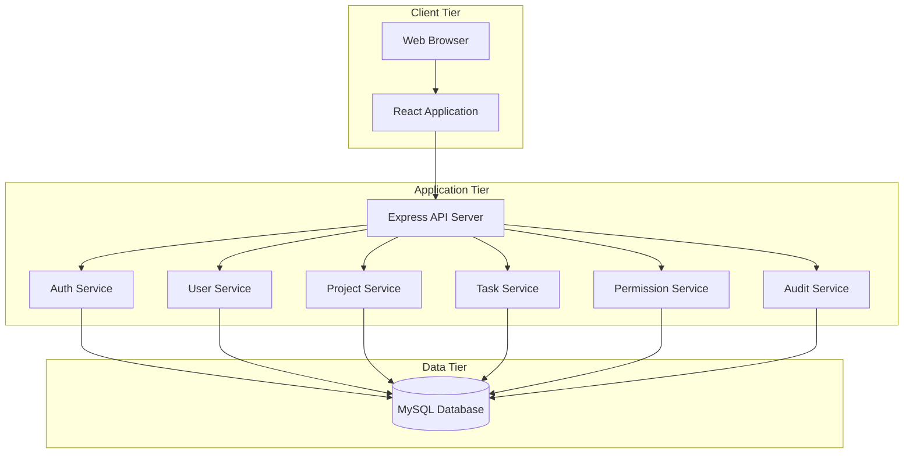
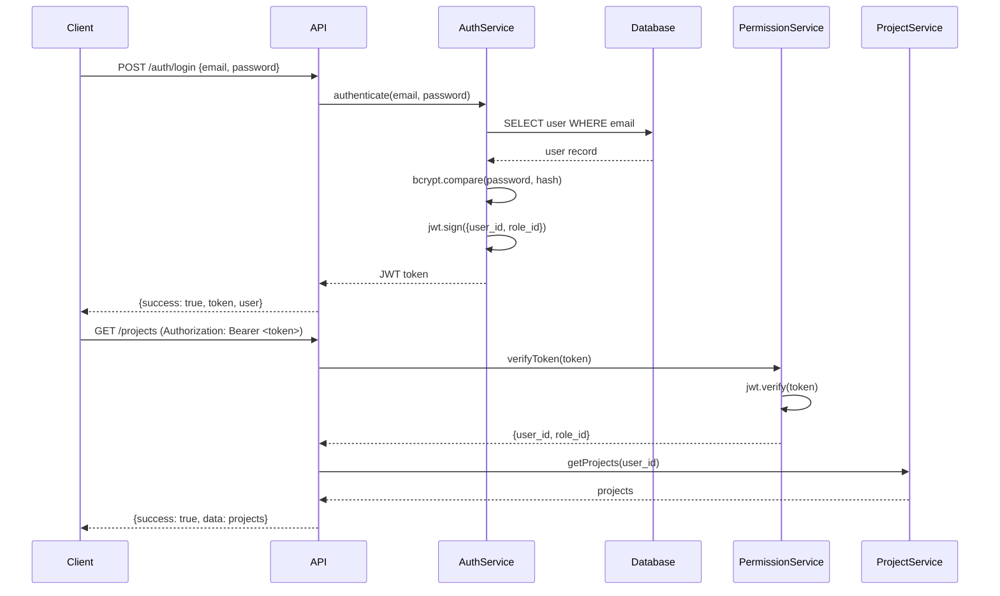
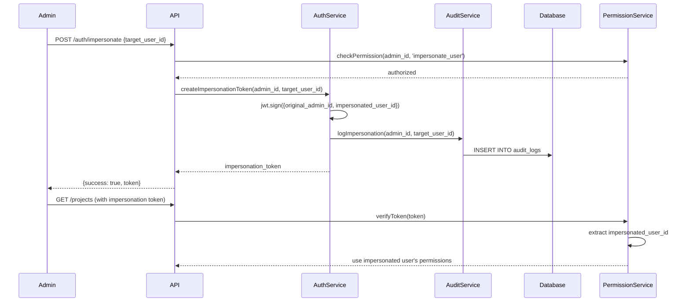
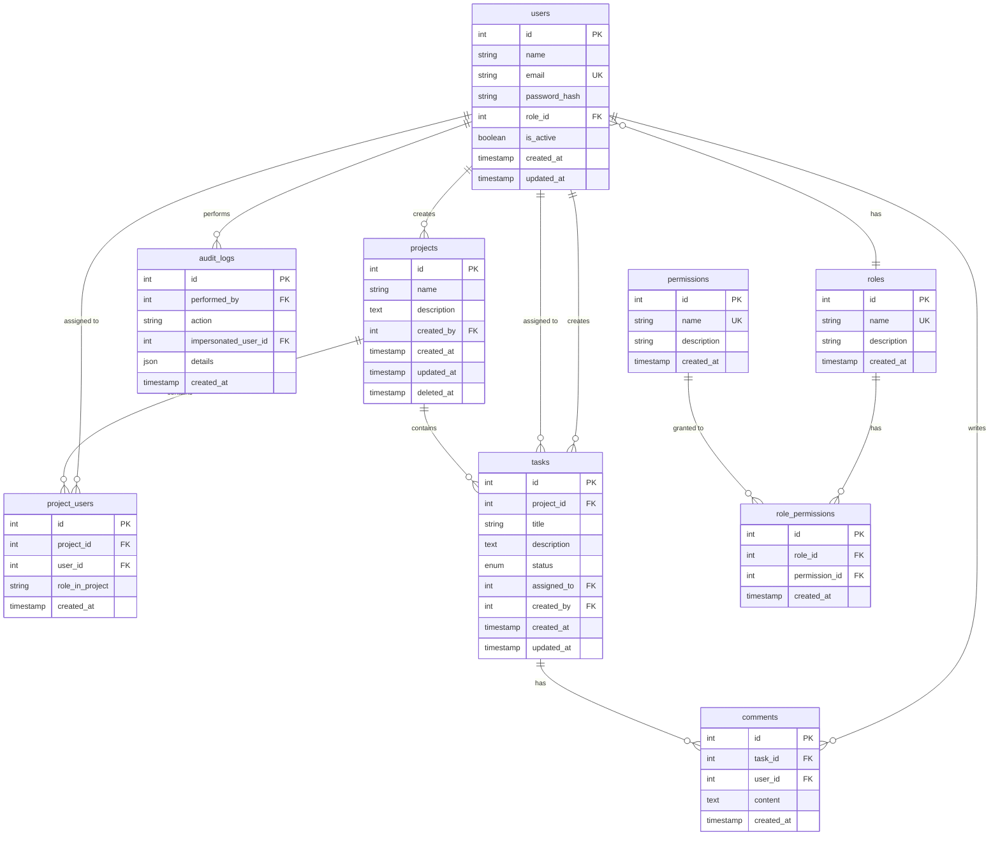
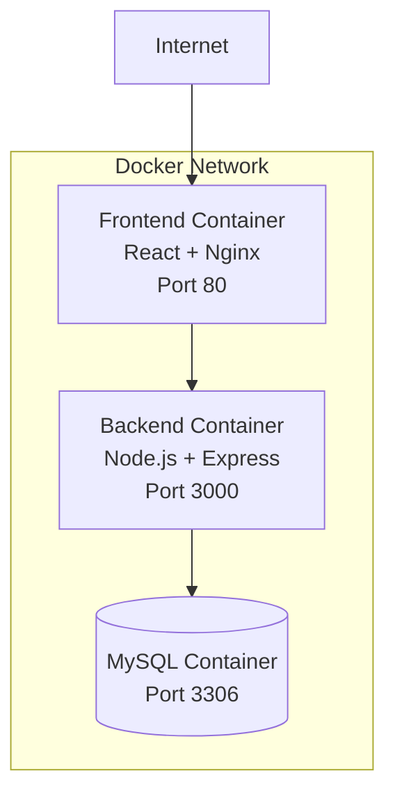

# Task Manager Design Document

## Overview

The Task Manager is a multi-user task management system (Jira-lite) that enables teams to manage projects, tasks, and user permissions. The system provides role-based access control (RBAC), admin impersonation capabilities, and a web-based interface for task tracking and collaboration.

### Key Features

- User authentication with JWT tokens
- Role-based access control with three roles: admin, project_manager, and user
- Admin impersonation for troubleshooting
- Project creation and management with ownership model
- Task creation, assignment, and status tracking
- Task commenting for collaboration
- Audit logging for administrative actions
- Soft delete support for data recovery
- Docker-based deployment

### Technology Stack

- **Backend**: Node.js with Express.js framework
- **Frontend**: React with React Router for navigation
- **Database**: MySQL 8.0
- **Authentication**: JWT (JSON Web Tokens)
- **Password Hashing**: bcrypt with cost factor 10
- **Containerization**: Docker and Docker Compose

## Architecture

### High-Level Architecture

The system follows a three-tier architecture:



### Service Layer Architecture

The backend is organized into service modules, each responsible for a specific domain:

- **Auth Service**: Handles authentication, JWT generation, and impersonation
- **User Service**: Manages user CRUD operations
- **Project Service**: Manages projects and project membership
- **Task Service**: Manages tasks and comments
- **Permission Service**: Evaluates permissions and provides middleware
- **Audit Service**: Logs administrative actions

### Authentication Flow



### Impersonation Flow



## Components and Interfaces

### Backend Components

#### 1. Express API Server

**Responsibilities:**
- Route HTTP requests to appropriate service handlers
- Apply middleware for authentication, validation, and error handling
- Return standardized JSON responses

**Key Middleware:**
- `express.json()`: Parse JSON request bodies
- `authenticate`: Verify JWT token and attach user to request
- `requirePermission(permission)`: Check user has required permission
- `validateRequest(schema)`: Validate request body against schema
- `errorHandler`: Catch and format errors

#### 2. Auth Service

**Interface:**
```typescript
interface AuthService {
  login(email: string, password: string): Promise<{token: string, user: User}>
  register(userData: UserCreateData): Promise<User>
  generateToken(userId: number, roleId: number): string
  verifyToken(token: string): {userId: number, roleId: number}
  createImpersonationToken(adminId: number, targetUserId: number): Promise<string>
  exitImpersonation(token: string): Promise<string>
  requestPasswordReset(email: string): Promise<void>
  resetPassword(token: string, newPassword: string): Promise<void>
}
```

**Key Operations:**
- Hash passwords with bcrypt (cost factor 10)
- Generate JWT tokens with 24-hour expiration
- Validate credentials with rate limiting (5 attempts per 15 minutes)
- Handle impersonation token creation with dual user IDs

#### 3. User Service

**Interface:**
```typescript
interface UserService {
  createUser(data: UserCreateData): Promise<User>
  getUserById(id: number): Promise<User | null>
  getUserByEmail(email: string): Promise<User | null>
  updateUser(id: number, data: UserUpdateData): Promise<User>
  deleteUser(id: number): Promise<void>
  listUsers(includeInactive: boolean): Promise<User[]>
  restoreUser(id: number): Promise<User>
}
```

**Key Operations:**
- Enforce unique email constraint
- Soft delete users by setting `is_active = false`
- Validate email format and password length

#### 4. Project Service

**Interface:**
```typescript
interface ProjectService {
  createProject(userId: number, data: ProjectCreateData): Promise<Project>
  getProjectById(id: number, userId: number): Promise<Project | null>
  listProjects(userId: number, hasViewAll: boolean): Promise<Project[]>
  updateProject(id: number, userId: number, data: ProjectUpdateData): Promise<Project>
  deleteProject(id: number, userId: number): Promise<void>
  addUserToProject(projectId: number, userId: number, roleInProject: string): Promise<void>
  removeUserFromProject(projectId: number, userId: number): Promise<void>
  getProjectMembers(projectId: number): Promise<User[]>
  isUserAssigned(projectId: number, userId: number): Promise<boolean>
}
```

**Key Operations:**
- Set creator as project owner
- Verify user is assigned before allowing access
- Cascade delete tasks and comments when project is deleted
- Track created_at and updated_at timestamps

#### 5. Task Service

**Interface:**
```typescript
interface TaskService {
  createTask(projectId: number, userId: number, data: TaskCreateData): Promise<Task>
  getTaskById(id: number): Promise<Task | null>
  listTasks(projectId: number, filters: TaskFilters): Promise<Task[]>
  updateTask(id: number, userId: number, data: TaskUpdateData): Promise<Task>
  deleteTask(id: number, userId: number): Promise<void>
  addComment(taskId: number, userId: number, content: string): Promise<Comment>
  getComments(taskId: number): Promise<Comment[]>
}
```

**Key Operations:**
- Default status to "todo" on creation
- Validate status is one of: "todo", "in_progress", "done"
- Support filtering by status and assignee
- Return comments in chronological order

#### 6. Permission Service

**Interface:**
```typescript
interface PermissionService {
  loadPermissions(): Promise<void>
  hasPermission(roleId: number, permission: string): boolean
  requirePermission(permission: string): Middleware
  checkProjectAccess(userId: number, projectId: number): Promise<boolean>
  isProjectOwner(userId: number, projectId: number): Promise<boolean>
}
```

**Key Operations:**
- Load role-permission mappings into memory at startup
- Provide middleware for permission checking
- Handle impersonation by using impersonated user's role
- Return 403 Forbidden when permission denied

#### 7. Audit Service

**Interface:**
```typescript
interface AuditService {
  logImpersonation(adminId: number, targetUserId: number): Promise<void>
  logUserAction(adminId: number, action: string, details: object): Promise<void>
  logPermissionChange(adminId: number, action: string, details: object): Promise<void>
  getAuditLogs(limit: number, offset: number): Promise<AuditLog[]>
}
```

**Key Operations:**
- Log all administrative actions with timestamp
- Retain logs indefinitely
- Return logs in descending chronological order

### Frontend Components

#### 1. React Application Structure

```
src/
├── components/
│   ├── auth/
│   │   ├── LoginForm.jsx
│   │   ├── PasswordResetForm.jsx
│   │   └── ImpersonationBanner.jsx
│   ├── layout/
│   │   ├── Header.jsx
│   │   ├── Navigation.jsx
│   │   └── Footer.jsx
│   ├── projects/
│   │   ├── ProjectList.jsx
│   │   ├── ProjectCard.jsx
│   │   ├── ProjectDetail.jsx
│   │   ├── CreateProjectForm.jsx
│   │   └── ProjectMemberManager.jsx
│   ├── tasks/
│   │   ├── TaskBoard.jsx
│   │   ├── TaskCard.jsx
│   │   ├── TaskDetail.jsx
│   │   ├── CreateTaskForm.jsx
│   │   ├── TaskStatusSelector.jsx
│   │   └── TaskComments.jsx
│   ├── users/
│   │   ├── UserList.jsx
│   │   ├── UserForm.jsx
│   │   └── UserCard.jsx
│   └── common/
│       ├── Button.jsx
│       ├── Input.jsx
│       ├── Select.jsx
│       └── ErrorMessage.jsx
├── contexts/
│   └── AuthContext.jsx
├── hooks/
│   ├── useAuth.js
│   ├── useProjects.js
│   └── useTasks.js
├── services/
│   └── api.js
├── utils/
│   ├── validation.js
│   └── formatting.js
├── App.jsx
└── index.jsx
```

#### 2. Authentication Context

**Responsibilities:**
- Store JWT token in localStorage
- Provide authentication state to all components
- Handle login, logout, and token refresh
- Manage impersonation state

**Interface:**
```typescript
interface AuthContextValue {
  user: User | null
  token: string | null
  isAuthenticated: boolean
  isImpersonating: boolean
  impersonatedUser: User | null
  login: (email: string, password: string) => Promise<void>
  logout: () => void
  impersonate: (userId: number) => Promise<void>
  exitImpersonation: () => Promise<void>
}
```

#### 3. API Service

**Responsibilities:**
- Make HTTP requests to backend API
- Attach JWT token to all requests
- Handle 401 responses by clearing auth state
- Parse and return standardized responses

**Interface:**
```typescript
interface ApiService {
  get<T>(path: string): Promise<T>
  post<T>(path: string, data: object): Promise<T>
  put<T>(path: string, data: object): Promise<T>
  delete<T>(path: string): Promise<T>
}
```

#### 4. Routing Structure

```typescript
<Routes>
  <Route path="/login" element={<LoginPage />} />
  <Route path="/reset-password" element={<PasswordResetPage />} />
  
  <Route element={<ProtectedRoute />}>
    <Route path="/" element={<Dashboard />} />
    <Route path="/projects" element={<ProjectList />} />
    <Route path="/projects/:id" element={<ProjectDetail />} />
    <Route path="/projects/new" element={<CreateProject />} />
    <Route path="/tasks/:id" element={<TaskDetail />} />
    
    <Route element={<AdminRoute />}>
      <Route path="/admin/users" element={<UserManagement />} />
      <Route path="/admin/audit-logs" element={<AuditLogs />} />
    </Route>
  </Route>
</Routes>
```

## Data Models

### Database Schema

#### Users Table

```sql
CREATE TABLE users (
  id INT PRIMARY KEY AUTO_INCREMENT,
  name VARCHAR(255) NOT NULL,
  email VARCHAR(255) NOT NULL UNIQUE,
  password_hash VARCHAR(255) NOT NULL,
  role_id INT NOT NULL,
  is_active BOOLEAN DEFAULT true,
  created_at TIMESTAMP DEFAULT CURRENT_TIMESTAMP,
  updated_at TIMESTAMP DEFAULT CURRENT_TIMESTAMP ON UPDATE CURRENT_TIMESTAMP,
  FOREIGN KEY (role_id) REFERENCES roles(id)
);

CREATE INDEX idx_users_email ON users(email);
CREATE INDEX idx_users_role_id ON users(role_id);
CREATE INDEX idx_users_is_active ON users(is_active);
```

#### Roles Table

```sql
CREATE TABLE roles (
  id INT PRIMARY KEY AUTO_INCREMENT,
  name VARCHAR(50) NOT NULL UNIQUE,
  description TEXT,
  created_at TIMESTAMP DEFAULT CURRENT_TIMESTAMP
);

-- Seed data
INSERT INTO roles (name, description) VALUES
  ('admin', 'Full system access including user management and impersonation'),
  ('project_manager', 'Can create and manage projects'),
  ('user', 'Can participate in assigned projects');
```

#### Permissions Table

```sql
CREATE TABLE permissions (
  id INT PRIMARY KEY AUTO_INCREMENT,
  name VARCHAR(100) NOT NULL UNIQUE,
  description TEXT,
  created_at TIMESTAMP DEFAULT CURRENT_TIMESTAMP
);

-- Seed data
INSERT INTO permissions (name, description) VALUES
  ('create_user', 'Create new user accounts'),
  ('update_user', 'Update user information'),
  ('delete_user', 'Delete user accounts'),
  ('view_all_users', 'View all users in the system'),
  ('create_project', 'Create new projects'),
  ('update_any_project', 'Update any project'),
  ('delete_any_project', 'Delete any project'),
  ('view_all_projects', 'View all projects'),
  ('assign_task', 'Assign tasks to users'),
  ('update_any_task', 'Update any task'),
  ('impersonate_user', 'Impersonate other users'),
  ('view_audit_logs', 'View audit logs'),
  ('view_deleted_records', 'View soft-deleted records'),
  ('restore_deleted_records', 'Restore soft-deleted records');
```

#### Role_Permissions Table

```sql
CREATE TABLE role_permissions (
  id INT PRIMARY KEY AUTO_INCREMENT,
  role_id INT NOT NULL,
  permission_id INT NOT NULL,
  created_at TIMESTAMP DEFAULT CURRENT_TIMESTAMP,
  FOREIGN KEY (role_id) REFERENCES roles(id) ON DELETE CASCADE,
  FOREIGN KEY (permission_id) REFERENCES permissions(id) ON DELETE CASCADE,
  UNIQUE KEY unique_role_permission (role_id, permission_id)
);

CREATE INDEX idx_role_permissions_role_id ON role_permissions(role_id);
```

#### Projects Table

```sql
CREATE TABLE projects (
  id INT PRIMARY KEY AUTO_INCREMENT,
  name VARCHAR(255) NOT NULL,
  description TEXT,
  created_by INT NOT NULL,
  created_at TIMESTAMP DEFAULT CURRENT_TIMESTAMP,
  updated_at TIMESTAMP DEFAULT CURRENT_TIMESTAMP ON UPDATE CURRENT_TIMESTAMP,
  deleted_at TIMESTAMP NULL,
  FOREIGN KEY (created_by) REFERENCES users(id)
);

CREATE INDEX idx_projects_created_by ON projects(created_by);
CREATE INDEX idx_projects_deleted_at ON projects(deleted_at);
CREATE INDEX idx_projects_updated_at ON projects(updated_at);
```

#### Project_Users Table

```sql
CREATE TABLE project_users (
  id INT PRIMARY KEY AUTO_INCREMENT,
  project_id INT NOT NULL,
  user_id INT NOT NULL,
  role_in_project VARCHAR(50) DEFAULT 'member',
  created_at TIMESTAMP DEFAULT CURRENT_TIMESTAMP,
  FOREIGN KEY (project_id) REFERENCES projects(id) ON DELETE CASCADE,
  FOREIGN KEY (user_id) REFERENCES users(id) ON DELETE CASCADE,
  UNIQUE KEY unique_project_user (project_id, user_id)
);

CREATE INDEX idx_project_users_project_id ON project_users(project_id);
CREATE INDEX idx_project_users_user_id ON project_users(user_id);
```

#### Tasks Table

```sql
CREATE TABLE tasks (
  id INT PRIMARY KEY AUTO_INCREMENT,
  project_id INT NOT NULL,
  title VARCHAR(255) NOT NULL,
  description TEXT,
  status ENUM('todo', 'in_progress', 'done') DEFAULT 'todo',
  assigned_to INT,
  created_by INT NOT NULL,
  created_at TIMESTAMP DEFAULT CURRENT_TIMESTAMP,
  updated_at TIMESTAMP DEFAULT CURRENT_TIMESTAMP ON UPDATE CURRENT_TIMESTAMP,
  FOREIGN KEY (project_id) REFERENCES projects(id) ON DELETE CASCADE,
  FOREIGN KEY (assigned_to) REFERENCES users(id),
  FOREIGN KEY (created_by) REFERENCES users(id)
);

CREATE INDEX idx_tasks_project_id ON tasks(project_id);
CREATE INDEX idx_tasks_assigned_to ON tasks(assigned_to);
CREATE INDEX idx_tasks_status ON tasks(status);
CREATE INDEX idx_tasks_created_by ON tasks(created_by);
```

#### Comments Table

```sql
CREATE TABLE comments (
  id INT PRIMARY KEY AUTO_INCREMENT,
  task_id INT NOT NULL,
  user_id INT NOT NULL,
  content TEXT NOT NULL,
  created_at TIMESTAMP DEFAULT CURRENT_TIMESTAMP,
  FOREIGN KEY (task_id) REFERENCES tasks(id) ON DELETE CASCADE,
  FOREIGN KEY (user_id) REFERENCES users(id)
);

CREATE INDEX idx_comments_task_id ON comments(task_id);
CREATE INDEX idx_comments_user_id ON comments(user_id);
CREATE INDEX idx_comments_created_at ON comments(created_at);
```

#### Audit_Logs Table

```sql
CREATE TABLE audit_logs (
  id INT PRIMARY KEY AUTO_INCREMENT,
  performed_by INT NOT NULL,
  action VARCHAR(255) NOT NULL,
  impersonated_user_id INT,
  details JSON,
  created_at TIMESTAMP DEFAULT CURRENT_TIMESTAMP,
  FOREIGN KEY (performed_by) REFERENCES users(id),
  FOREIGN KEY (impersonated_user_id) REFERENCES users(id)
);

CREATE INDEX idx_audit_logs_performed_by ON audit_logs(performed_by);
CREATE INDEX idx_audit_logs_created_at ON audit_logs(created_at);
CREATE INDEX idx_audit_logs_impersonated_user_id ON audit_logs(impersonated_user_id);
```

#### Password_Reset_Tokens Table

```sql
CREATE TABLE password_reset_tokens (
  id INT PRIMARY KEY AUTO_INCREMENT,
  user_id INT NOT NULL,
  token_hash VARCHAR(255) NOT NULL,
  expires_at TIMESTAMP NOT NULL,
  used BOOLEAN DEFAULT false,
  created_at TIMESTAMP DEFAULT CURRENT_TIMESTAMP,
  FOREIGN KEY (user_id) REFERENCES users(id) ON DELETE CASCADE
);

CREATE INDEX idx_password_reset_tokens_user_id ON password_reset_tokens(user_id);
CREATE INDEX idx_password_reset_tokens_expires_at ON password_reset_tokens(expires_at);
```

### Entity Relationships



### API Endpoints

#### Authentication Endpoints

**POST /auth/register**
- Request: `{name, email, password, role_id}`
- Response: `{success: true, data: {user}, message}`
- Permissions: Public

**POST /auth/login**
- Request: `{email, password}`
- Response: `{success: true, data: {token, user}, message}`
- Permissions: Public
- Rate Limit: 5 attempts per 15 minutes per email

**POST /auth/impersonate**
- Request: `{target_user_id}`
- Response: `{success: true, data: {token, impersonated_user}, message}`
- Permissions: `impersonate_user`

**POST /auth/exit-impersonation**
- Request: None (uses token)
- Response: `{success: true, data: {token}, message}`
- Permissions: Authenticated (must be in impersonation session)

**POST /auth/request-reset**
- Request: `{email}`
- Response: `{success: true, message}`
- Permissions: Public

**POST /auth/reset-password**
- Request: `{token, new_password}`
- Response: `{success: true, message}`
- Permissions: Public

#### User Endpoints

**GET /users**
- Query: `?include_inactive=true`
- Response: `{success: true, data: {users}, message}`
- Permissions: `view_all_users`

**GET /users/:id**
- Response: `{success: true, data: {user}, message}`
- Permissions: Authenticated (own profile) or `view_all_users`

**POST /users**
- Request: `{name, email, password, role_id}`
- Response: `{success: true, data: {user}, message}`
- Permissions: `create_user`

**PUT /users/:id**
- Request: `{name?, email?, role_id?, is_active?}`
- Response: `{success: true, data: {user}, message}`
- Permissions: `update_user`

**DELETE /users/:id**
- Response: `{success: true, message}`
- Permissions: `delete_user`

**POST /users/:id/restore**
- Response: `{success: true, data: {user}, message}`
- Permissions: `restore_deleted_records`

#### Project Endpoints

**GET /projects**
- Response: `{success: true, data: {projects}, message}`
- Permissions: Authenticated (returns assigned projects or all if `view_all_projects`)

**GET /projects/:id**
- Response: `{success: true, data: {project, members, task_count}, message}`
- Permissions: Assigned user or `view_all_projects`

**POST /projects**
- Request: `{name, description}`
- Response: `{success: true, data: {project}, message}`
- Permissions: `create_project`

**PUT /projects/:id**
- Request: `{name?, description?}`
- Response: `{success: true, data: {project}, message}`
- Permissions: Project owner or `update_any_project`

**DELETE /projects/:id**
- Response: `{success: true, message}`
- Permissions: Project owner or `delete_any_project`

**POST /projects/:id/members**
- Request: `{user_id, role_in_project}`
- Response: `{success: true, message}`
- Permissions: Project owner

**DELETE /projects/:id/members/:user_id**
- Response: `{success: true, message}`
- Permissions: Project owner

#### Task Endpoints

**GET /projects/:project_id/tasks**
- Query: `?status=todo&assigned_to=5`
- Response: `{success: true, data: {tasks}, message}`
- Permissions: Assigned to project

**GET /tasks/:id**
- Response: `{success: true, data: {task, comments}, message}`
- Permissions: Assigned to project

**POST /projects/:project_id/tasks**
- Request: `{title, description, assigned_to?}`
- Response: `{success: true, data: {task}, message}`
- Permissions: Assigned to project

**PUT /tasks/:id**
- Request: `{title?, description?, status?, assigned_to?}`
- Response: `{success: true, data: {task}, message}`
- Permissions: Task assignee (status only), project owner, or `update_any_task`

**DELETE /tasks/:id**
- Response: `{success: true, message}`
- Permissions: Project owner or `update_any_task`

**POST /tasks/:id/comments**
- Request: `{content}`
- Response: `{success: true, data: {comment}, message}`
- Permissions: Assigned to project

#### Audit Endpoints

**GET /audit-logs**
- Query: `?limit=50&offset=0`
- Response: `{success: true, data: {logs, total}, message}`
- Permissions: `view_audit_logs`


## Security Considerations

### Authentication Security

1. **Password Storage**: All passwords are hashed using bcrypt with cost factor 10 before storage. Plain text passwords are never stored.

2. **JWT Token Security**:
   - Tokens expire after 24 hours
   - Tokens are signed with a secret key stored in environment variables
   - Tokens contain minimal payload: user_id, role_id, and optionally impersonation data
   - Tokens are transmitted via Authorization header (Bearer scheme)

3. **Rate Limiting**: Login endpoint implements rate limiting of 5 attempts per email per 15-minute window to prevent brute force attacks.

4. **Password Requirements**: Minimum 8 characters length enforced at API level.

5. **HTTPS Only**: All authentication requests must be transmitted over HTTPS in production.

### Authorization Security

1. **Permission-Based Access Control**: All authorization checks use permissions rather than role names, allowing flexible permission assignment.

2. **Middleware Protection**: All protected endpoints use permission middleware that verifies JWT and checks permissions before allowing access.

3. **Project-Level Access Control**: Users can only access projects they are assigned to, unless they have `view_all_projects` permission.

4. **Task-Level Access Control**: Users can only access tasks within projects they are assigned to.

5. **Impersonation Audit Trail**: All impersonation actions are logged with admin ID, target user ID, and timestamp.

### Input Validation

1. **SQL Injection Prevention**: All database queries use parameterized statements via ORM or prepared statements.

2. **XSS Prevention**: All user inputs are sanitized before storage and escaped when rendered in frontend.

3. **Email Validation**: Email addresses are validated against standard email format regex.

4. **Type Validation**: All API inputs are validated for correct types using validation middleware.

5. **Length Constraints**: String fields have maximum length constraints enforced at API and database levels.

### Data Security

1. **Soft Delete**: Users and projects use soft delete to prevent accidental data loss and maintain referential integrity.

2. **Foreign Key Constraints**: All relationships enforce foreign key constraints to maintain data integrity.

3. **Cascade Delete**: When projects are deleted, associated tasks and comments are cascade deleted.

4. **Audit Logging**: All administrative actions are logged indefinitely for compliance and troubleshooting.

### Environment Security

1. **Environment Variables**: Sensitive configuration (database credentials, JWT secret) stored in environment variables, never in code.

2. **Docker Secrets**: In production, use Docker secrets or similar mechanisms for sensitive data.

3. **Database Access**: Database is not exposed to public network, only accessible from application container.

## Error Handling

### Error Response Format

All errors follow a consistent JSON format:

```json
{
  "success": false,
  "error": "Error message describing what went wrong",
  "timestamp": "2024-01-15T10:30:00.000Z"
}
```

### HTTP Status Codes

- **200 OK**: Successful GET, PUT, DELETE operations
- **201 Created**: Successful POST operations creating resources
- **400 Bad Request**: Validation errors, malformed JSON, missing required fields
- **401 Unauthorized**: Missing or invalid JWT token, expired token
- **403 Forbidden**: Valid authentication but insufficient permissions
- **404 Not Found**: Requested resource does not exist
- **429 Too Many Requests**: Rate limit exceeded
- **500 Internal Server Error**: Database errors, unexpected server errors

### Error Categories

#### 1. Validation Errors (400)

```json
{
  "success": false,
  "error": "Validation failed",
  "details": [
    {"field": "email", "message": "Invalid email format"},
    {"field": "password", "message": "Password must be at least 8 characters"}
  ],
  "timestamp": "2024-01-15T10:30:00.000Z"
}
```

#### 2. Authentication Errors (401)

- "Invalid credentials"
- "Token expired"
- "Invalid token"
- "Account is inactive"

#### 3. Authorization Errors (403)

- "Permission denied: [permission_name] required"
- "You are not assigned to this project"
- "Only project owner can perform this action"

#### 4. Not Found Errors (404)

- "User not found"
- "Project not found"
- "Task not found"

#### 5. Rate Limit Errors (429)

- "Too many login attempts. Please try again in [X] minutes"

#### 6. Server Errors (500)

- "Database connection failed"
- "Internal server error"

### Error Logging

All errors are logged to console with:
- Timestamp
- Error message
- Stack trace
- Request context (method, path, user_id if available)

Example log format:
```
[2024-01-15T10:30:00.000Z] ERROR: Database connection failed
  at DatabaseService.connect (database.js:45)
  Request: GET /projects by user_id=5
  Stack: Error: connect ECONNREFUSED 127.0.0.1:3306
```

### Frontend Error Handling

1. **Network Errors**: Display user-friendly message "Unable to connect to server. Please check your internet connection."

2. **401 Responses**: Automatically clear authentication state and redirect to login page.

3. **Validation Errors**: Display field-specific error messages next to form inputs.

4. **Generic Errors**: Display error message from API response in a toast notification.

## Testing Strategy

### Unit Testing

Unit tests verify specific examples, edge cases, and error conditions for individual functions and components.

**Backend Unit Tests:**
- Service layer functions (Auth, User, Project, Task, Permission, Audit services)
- Middleware functions (authentication, permission checking, validation)
- Utility functions (password hashing, token generation, validation)
- Error handling paths

**Frontend Unit Tests:**
- React component rendering
- Form validation logic
- API service functions
- Utility functions (formatting, validation)

**Testing Framework:** Jest for both backend and frontend

**Example Unit Tests:**
- Test that bcrypt hashing produces different hashes for same password
- Test that invalid email format is rejected
- Test that expired tokens are rejected
- Test that soft delete sets is_active to false
- Test that project owner can add members
- Test that non-project members cannot access project

### Property-Based Testing

Property-based tests verify universal properties across many randomly generated inputs. Each test runs a minimum of 100 iterations.

**Testing Framework:** fast-check (JavaScript property-based testing library)

**Configuration:**
```javascript
import fc from 'fast-check';

// Each property test runs 100 iterations by default
fc.assert(
  fc.property(/* generators */, (/* inputs */) => {
    // Test property
  }),
  { numRuns: 100 }
);
```

**Test Tagging:**
Each property test includes a comment referencing the design document property:
```javascript
// Feature: task-manager, Property 1: JWT round-trip preserves user identity
test('JWT encoding and decoding preserves user data', () => {
  // test implementation
});
```

Properties will be defined in the Correctness Properties section below.

### Integration Testing

Integration tests verify that components work together correctly:
- API endpoint tests with real database
- Authentication flow tests
- Permission checking across services
- Database transaction tests

**Testing Framework:** Jest with supertest for API testing

### End-to-End Testing

E2E tests verify complete user workflows:
- User registration and login
- Project creation and task management
- Admin impersonation flow
- Password reset flow

**Testing Framework:** Playwright or Cypress

### Test Database

Use a separate test database that is reset before each test suite:
```javascript
beforeAll(async () => {
  await database.connect(TEST_DB_CONFIG);
  await database.migrate();
  await database.seed();
});

afterAll(async () => {
  await database.dropAllTables();
  await database.disconnect();
});
```


## Correctness Properties

A property is a characteristic or behavior that should hold true across all valid executions of a system—essentially, a formal statement about what the system should do. Properties serve as the bridge between human-readable specifications and machine-verifiable correctness guarantees.

### Property 1: JWT Round-Trip Preserves Identity

*For any* user_id and role_id, encoding them into a JWT token and then decoding that token should produce the same user_id and role_id values.

**Validates: Requirements 1.1**

### Property 2: Password Hashing Is Non-Deterministic

*For any* password string, hashing it twice with bcrypt should produce two different hash values (due to random salt), but both hashes should verify successfully against the original password.

**Validates: Requirements 1.3**

### Property 3: User Creation Assigns Exactly One Role

*For any* valid user creation data, the created user record should have exactly one role_id that is not null.

**Validates: Requirements 2.2**

### Property 4: Impersonation Token Contains Both User IDs

*For any* admin user and target user, generating an impersonation token should produce a JWT containing both the original admin's user_id and the impersonated user's user_id.

**Validates: Requirements 3.1**

### Property 5: Impersonation Creates Audit Log

*For any* impersonation action, an audit log entry should be created containing the admin_id (performed_by), impersonated_user_id, and created_at timestamp.

**Validates: Requirements 3.2**

### Property 6: Impersonation Uses Target User Permissions

*For any* impersonation session, permission checks should evaluate based on the impersonated user's role, not the admin's role.

**Validates: Requirements 3.3**

### Property 7: Exit Impersonation Round-Trip

*For any* admin user, starting impersonation and then exiting impersonation should return a token containing only the admin's user_id (no impersonated_user_id).

**Validates: Requirements 3.4**

### Property 8: Non-Admin Cannot Impersonate

*For any* user without admin role, attempting to impersonate another user should return a permission denied error.

**Validates: Requirements 3.5**

### Property 9: User Creation Includes Required Fields

*For any* valid user creation request, the created user record should contain name, email, password_hash, and role_id fields with non-null values.

**Validates: Requirements 4.1**

### Property 10: Email Uniqueness Constraint

*For any* email address, after successfully creating a user with that email, attempting to create a second user with the same email should fail with a uniqueness constraint error.

**Validates: Requirements 4.2**

### Property 11: User Update Reflects Changes

*For any* user and valid update data (name, email, role_id, or is_active), updating the user should result in the user record reflecting the new values.

**Validates: Requirements 4.3**

### Property 12: User Deletion Is Soft Delete

*For any* user, deleting that user should set is_active to false while the user record remains in the database (id still queryable with appropriate permissions).

**Validates: Requirements 4.4**

### Property 13: Inactive Users Cannot Login

*For any* user with is_active set to false, login attempts with correct credentials should be rejected with an authentication error.

**Validates: Requirements 4.5**

### Property 14: Project Creation Includes Required Fields

*For any* valid project creation request, the created project record should contain name, description, created_by, created_at, and updated_at fields with non-null values.

**Validates: Requirements 5.1, 5.3**

### Property 15: Project Creator Is Owner

*For any* project creation, the created_by field should equal the requesting user's user_id.

**Validates: Requirements 5.2**

### Property 16: View All Projects Permission Returns All

*For any* user with view_all_projects permission, querying projects should return all projects in the database (not filtered by assignment).

**Validates: Requirements 5.4**

### Property 17: Without View All, Only Assigned Projects Returned

*For any* user without view_all_projects permission, querying projects should return only projects where the user appears in the project_users table for that project.

**Validates: Requirements 5.5**

### Property 18: Project Owner Can Add Members

*For any* project and user, if the requesting user is the project owner (created_by), they should be able to add the target user to the project_users table.

**Validates: Requirements 6.1**

### Property 19: Project Owner Can Remove Members

*For any* project and assigned user, if the requesting user is the project owner, they should be able to remove the target user from the project_users table.

**Validates: Requirements 6.2**

### Property 20: Adding User Creates Project Membership Record

*For any* project and user, adding the user to the project should create a record in project_users with project_id, user_id, and role_in_project fields.

**Validates: Requirements 6.3**

### Property 21: Project Access Requires Assignment Or Permission

*For any* user and project, the user can access project details if and only if they are in the project_users table for that project OR they have view_all_projects permission.

**Validates: Requirements 6.4, 6.5**

### Property 22: Authorized Users Can Update Projects

*For any* project and update data, if the requesting user is the project owner OR has update_any_project permission, the update should succeed and reflect the new values.

**Validates: Requirements 7.1**

### Property 23: Authorized Users Can Delete Projects

*For any* project, if the requesting user is the project owner OR has delete_any_project permission, the deletion should succeed.

**Validates: Requirements 7.2**

### Property 24: Project Update Advances Timestamp

*For any* project update, the updated_at timestamp after the update should be greater than the updated_at timestamp before the update.

**Validates: Requirements 7.3**

### Property 25: Project Deletion Cascades To Tasks And Comments

*For any* project with associated tasks and comments, deleting the project should also remove all tasks and comments associated with that project (cascade delete).

**Validates: Requirements 7.4**

### Property 26: Unauthorized Users Cannot Modify Projects

*For any* user who is not the project owner and lacks update_any_project or delete_any_project permission, attempts to update or delete the project should return a permission denied error.

**Validates: Requirements 7.5**

### Property 27: Assigned Users Can Create Tasks

*For any* project and user, if the user is in the project_users table for that project, they should be able to create tasks with title, description, and status fields.

**Validates: Requirements 8.1**

### Property 28: Task Creation Defaults Status To Todo

*For any* task created without an explicit status value, the task's status field should be set to "todo".

**Validates: Requirements 8.2**

### Property 29: Task Status Must Be Valid Enum Value

*For any* task, attempting to set the status to a value other than "todo", "in_progress", or "done" should be rejected with a validation error.

**Validates: Requirements 8.3, 9.4**

### Property 30: Authorized Users Can Assign Tasks

*For any* task and target user, if the requesting user has assign_task permission and the target user is in the project_users table, setting assigned_to should succeed.

**Validates: Requirements 8.4**

### Property 31: Task Creation Includes Required Fields

*For any* task creation, the created task record should contain created_by, created_at, and updated_at fields with non-null values.

**Validates: Requirements 8.5**

### Property 32: Task Assignee Can Update Status

*For any* task, if the requesting user's user_id equals the task's assigned_to field, they should be able to update the status field.

**Validates: Requirements 9.1**

### Property 33: Update Any Task Permission Allows All Updates

*For any* task and user with update_any_task permission, the user should be able to update any field of the task regardless of assignment.

**Validates: Requirements 9.2**

### Property 34: Task Update Advances Timestamp

*For any* task update, the updated_at timestamp after the update should be greater than the updated_at timestamp before the update.

**Validates: Requirements 9.3**

### Property 35: Unauthorized Users Cannot Update Tasks

*For any* user who is not the task assignee and lacks update_any_task permission, attempts to update the task should return a permission denied error.

**Validates: Requirements 9.5**

### Property 36: Assigned Users Can Create Comments

*For any* task and user, if the user is in the project_users table for the project containing the task, they should be able to create comments with content.

**Validates: Requirements 10.1**

### Property 37: Comment Creation Includes Required Fields

*For any* comment creation, the created comment record should contain user_id, task_id, content, and created_at fields with non-null values.

**Validates: Requirements 10.2**

### Property 38: Comments Returned In Chronological Order

*For any* task with multiple comments, querying the comments should return them ordered by created_at in ascending order (oldest first).

**Validates: Requirements 10.3**

### Property 39: Comments Include Commenter Name

*For any* comment in a query response, the response should include the name of the user who created the comment (joined from users table).

**Validates: Requirements 10.4**

### Property 40: Non-Assigned Users Cannot Comment

*For any* user not in the project_users table for the project containing a task, attempts to create comments on that task should return a permission denied error.

**Validates: Requirements 10.5**

### Property 41: Permission Check Returns Correct Boolean

*For any* user and permission name, checking if the user has that permission should return true if their role has that permission in the role_permissions table, false otherwise.

**Validates: Requirements 11.3**

### Property 42: Missing Permission Returns 403

*For any* API request requiring a permission, if the requesting user's role lacks that permission, the response should be 403 Forbidden.

**Validates: Requirements 11.4**

### Property 43: Admin Actions Create Audit Logs

*For any* admin action (user create/update/delete, permission modification), an audit log entry should be created with performed_by, action description, and created_at.

**Validates: Requirements 12.2, 12.3**

### Property 44: Audit Logs Returned In Reverse Chronological Order

*For any* audit log query, the results should be ordered by created_at in descending order (newest first).

**Validates: Requirements 12.4**

### Property 45: Invalid Email Format Rejected

*For any* string that does not match standard email format (contains @, has domain), authentication and registration requests should be rejected with a validation error.

**Validates: Requirements 13.3**

### Property 46: Short Passwords Rejected

*For any* password string with length less than 8 characters, registration and password reset requests should be rejected with a validation error.

**Validates: Requirements 13.4**

### Property 47: Missing Required Fields Return 400

*For any* API request missing a required field, the response should be 400 Bad Request with an error message indicating which field is missing.

**Validates: Requirements 15.1**

### Property 48: Wrong Field Types Return 400

*For any* API request where a field has the wrong type (e.g., string instead of number), the response should be 400 Bad Request with a type validation error.

**Validates: Requirements 15.2**

### Property 49: Excessive String Length Rejected

*For any* API request with a string field exceeding the maximum length constraint, the response should be 400 Bad Request with a length validation error.

**Validates: Requirements 15.3**

### Property 50: Valid Token Populates Auth Context

*For any* valid JWT token stored in localStorage, loading the application should populate the authentication context with the user_id and role_id from the token.

**Validates: Requirements 16.3**

### Property 51: UI Hides Actions Without Permission

*For any* user lacking a specific permission (create_project, create_user, delete_any_project, impersonate_user), the corresponding UI control should not be rendered in the DOM.

**Validates: Requirements 17.1, 17.2, 17.3, 17.4**

### Property 52: Impersonation Banner Displays During Session

*For any* active impersonation session, the UI should display a banner containing the text "You are impersonating" and the impersonated user's name, along with an exit button.

**Validates: Requirements 17.5**

### Property 53: Dashboard Shows Only Assigned Projects

*For any* user without view_all_projects permission, the dashboard should display exactly the set of projects where the user appears in the project_users table.

**Validates: Requirements 18.1**

### Property 54: Dashboard Includes Project Metadata

*For any* project displayed in the dashboard, the display should include the project's name, description, and task count.

**Validates: Requirements 18.3**

### Property 55: Projects Sorted By Updated Time

*For any* list of projects, they should be ordered by updated_at in descending order (most recently updated first).

**Validates: Requirements 18.5**

### Property 56: Project Detail Shows Required Fields

*For any* project detail view, the display should include the project's name, description, and created_by information.

**Validates: Requirements 19.1**

### Property 57: Tasks Grouped By Status

*For any* project detail view, tasks should be grouped into three categories based on their status: "todo", "in_progress", and "done".

**Validates: Requirements 19.2**

### Property 58: Task Display Includes Required Fields

*For any* task displayed in the project view, the display should include title, description, assigned_to name, and created_at.

**Validates: Requirements 19.3**

### Property 59: Assign Button Visible With Permission

*For any* user with assign_task permission viewing a project, an "Assign" button should be visible for each task.

**Validates: Requirements 19.4**

### Property 60: Create Task Button Visible For Assigned Users

*For any* user in the project_users table for a project, a "Create Task" button should be visible in the project view.

**Validates: Requirements 19.5**

### Property 61: Success Response Has Standard Structure

*For any* successful API request, the response should be a JSON object with success field set to true, a data field containing the result, and a message field.

**Validates: Requirements 21.1, 21.4**

### Property 62: Error Response Has Standard Structure

*For any* failed API request, the response should be a JSON object with success field set to false and an error field containing the error message.

**Validates: Requirements 21.2**

### Property 63: HTTP Status Codes Match Outcomes

*For any* API response, the HTTP status code should match the outcome: 200/201 for success, 400 for validation errors, 401 for auth errors, 403 for permission errors, 404 for not found, 500 for server errors.

**Validates: Requirements 21.3**

### Property 64: All Responses Include ISO 8601 Timestamp

*For any* API response, the response should include a timestamp field containing a valid ISO 8601 formatted datetime string.

**Validates: Requirements 21.5**

### Property 65: Project Owner Can Update All Task Fields

*For any* task in a project, if the requesting user is the project owner (created_by), they should be able to update title, description, status, and assigned_to fields.

**Validates: Requirements 22.1**

### Property 66: Task Assignee Can Only Update Status

*For any* task, if the requesting user is the task assignee, they should be able to update the status field but attempts to update title, description, or assigned_to should be rejected.

**Validates: Requirements 22.3**

### Property 67: Not Found Returns 404

*For any* API request for a resource that does not exist (user, project, task), the response should be 404 Not Found with an appropriate error message.

**Validates: Requirements 25.3**

### Property 68: Password Reset Token Has One Hour Expiration

*For any* password reset token generation, the token should have an expires_at timestamp that is exactly 1 hour after the created_at timestamp.

**Validates: Requirements 26.1**

### Property 69: Password Reset Creates Database Record

*For any* password reset request, a record should be created in the password_reset_tokens table with user_id, token_hash, and expires_at.

**Validates: Requirements 26.2**

### Property 70: Expired Reset Tokens Rejected

*For any* password reset token where the current time is after expires_at, attempting to use the token should be rejected with an error.

**Validates: Requirements 26.3**

### Property 71: Valid Reset Updates Password

*For any* valid (non-expired, unused) reset token and new password, the password reset should update the user's password_hash to the bcrypt hash of the new password.

**Validates: Requirements 26.4**

### Property 72: Reset Token Single Use

*For any* password reset token, after successfully using it to reset a password, attempting to use the same token again should be rejected.

**Validates: Requirements 26.5**

### Property 73: Status Filter Returns Matching Tasks

*For any* status filter value, all returned tasks should have a status field equal to the filter value.

**Validates: Requirements 27.1**

### Property 74: Assignee Filter Returns Matching Tasks

*For any* assignee filter value (user_id), all returned tasks should have an assigned_to field equal to the filter value.

**Validates: Requirements 27.2**

### Property 75: Multiple Filters Use AND Logic

*For any* combination of filters (status and assignee), all returned tasks should match all filter criteria (intersection, not union).

**Validates: Requirements 27.3**

### Property 76: No Filters Returns All Tasks

*For any* project, querying tasks with no filters should return all tasks in that project.

**Validates: Requirements 27.4**

### Property 77: Multiple Status Values Use OR Logic

*For any* list of status values in a filter, returned tasks should match any one of the status values (union within the status dimension).

**Validates: Requirements 27.5**

### Property 78: Project Soft Delete Sets Timestamp

*For any* project deletion, the project record should remain in the database with a deleted_at timestamp set to the deletion time (not null).

**Validates: Requirements 28.2**

### Property 79: Soft Deleted Records Excluded By Default

*For any* query for users or projects, records where is_active is false or deleted_at is not null should be excluded from results unless explicitly requested.

**Validates: Requirements 28.3**

### Property 80: View Deleted Permission Includes Soft Deleted

*For any* user with view_deleted_records permission, queries should include records where is_active is false or deleted_at is not null.

**Validates: Requirements 28.4**

### Property 81: Restore Permission Allows Undelete

*For any* user with restore_deleted_records permission and a soft-deleted record, the restore operation should set is_active to true or deleted_at to null.

**Validates: Requirements 28.5**

### Property 82: Valid JSON Parses Successfully

*For any* valid JSON string in a request body, the system should successfully parse it into a JavaScript object.

**Validates: Requirements 30.1**

### Property 83: Malformed JSON Returns 400

*For any* malformed JSON string in a request body, the system should return 400 Bad Request with error message "Invalid JSON format".

**Validates: Requirements 30.2**

### Property 84: Response Objects Serialized To JSON

*For any* JavaScript object returned as a response, the system should serialize it to a JSON string.

**Validates: Requirements 30.3**

### Property 85: JSON Round-Trip Preserves Structure

*For any* valid JavaScript object, serializing it to JSON and then parsing the JSON should produce an equivalent object (same structure and values).

**Validates: Requirements 30.4**

### Property 86: JSON Responses Have Correct Content-Type

*For any* API response containing JSON, the Content-Type header should be set to "application/json".

**Validates: Requirements 30.5**


## Deployment Architecture

### Docker Configuration

The application uses Docker and Docker Compose for containerized deployment, ensuring consistent environments across development, testing, and production.

#### Container Architecture



#### Backend Dockerfile

```dockerfile
FROM node:18-alpine

WORKDIR /app

# Copy package files
COPY package*.json ./

# Install dependencies
RUN npm ci --only=production

# Copy application code
COPY . .

# Expose port
EXPOSE 3000

# Start application
CMD ["node", "src/server.js"]
```

#### Frontend Dockerfile

```dockerfile
FROM node:18-alpine AS builder

WORKDIR /app

# Copy package files
COPY package*.json ./

# Install dependencies
RUN npm ci

# Copy application code
COPY . .

# Build production bundle
RUN npm run build

# Production stage
FROM nginx:alpine

# Copy built files to nginx
COPY --from=builder /app/build /usr/share/nginx/html

# Copy nginx configuration
COPY nginx.conf /etc/nginx/conf.d/default.conf

EXPOSE 80

CMD ["nginx", "-g", "daemon off;"]
```

#### Docker Compose Configuration

```yaml
version: '3.8'

services:
  database:
    image: mysql:8.0
    container_name: taskmanager-db
    environment:
      MYSQL_ROOT_PASSWORD: ${DB_ROOT_PASSWORD}
      MYSQL_DATABASE: ${DB_NAME}
      MYSQL_USER: ${DB_USER}
      MYSQL_PASSWORD: ${DB_PASSWORD}
    ports:
      - "3306:3306"
    volumes:
      - db_data:/var/lib/mysql
      - ./database/init.sql:/docker-entrypoint-initdb.d/init.sql
    networks:
      - taskmanager-network
    healthcheck:
      test: ["CMD", "mysqladmin", "ping", "-h", "localhost"]
      interval: 10s
      timeout: 5s
      retries: 5

  backend:
    build:
      context: ./backend
      dockerfile: Dockerfile
    container_name: taskmanager-backend
    environment:
      NODE_ENV: production
      DB_HOST: database
      DB_PORT: 3306
      DB_USER: ${DB_USER}
      DB_PASSWORD: ${DB_PASSWORD}
      DB_NAME: ${DB_NAME}
      JWT_SECRET: ${JWT_SECRET}
      JWT_EXPIRATION: 24h
      BCRYPT_COST_FACTOR: 10
      PORT: 3000
    ports:
      - "3000:3000"
    depends_on:
      database:
        condition: service_healthy
    networks:
      - taskmanager-network
    volumes:
      - ./backend/logs:/app/logs

  frontend:
    build:
      context: ./frontend
      dockerfile: Dockerfile
    container_name: taskmanager-frontend
    environment:
      REACT_APP_API_URL: http://localhost:3000
    ports:
      - "80:80"
    depends_on:
      - backend
    networks:
      - taskmanager-network

volumes:
  db_data:
    driver: local

networks:
  taskmanager-network:
    driver: bridge
```

#### Environment Variables

**.env.example**
```bash
# Database Configuration
DB_HOST=database
DB_PORT=3306
DB_USER=taskmanager
DB_PASSWORD=secure_password_here
DB_NAME=taskmanager
DB_ROOT_PASSWORD=root_password_here

# JWT Configuration
JWT_SECRET=your_jwt_secret_key_here_minimum_32_characters
JWT_EXPIRATION=24h

# Bcrypt Configuration
BCRYPT_COST_FACTOR=10

# Server Configuration
PORT=3000
NODE_ENV=production

# Frontend Configuration
REACT_APP_API_URL=http://localhost:3000
```

### Database Initialization

**database/init.sql**
```sql
-- This file runs automatically when the database container starts for the first time

-- Create tables (schema from Data Models section)
-- Create indexes
-- Insert seed data (roles, permissions, role_permissions)
-- Create default admin user

-- See Data Models section for complete schema
```

### Nginx Configuration

**nginx.conf**
```nginx
server {
    listen 80;
    server_name localhost;
    
    root /usr/share/nginx/html;
    index index.html;
    
    # Serve static files
    location / {
        try_files $uri $uri/ /index.html;
    }
    
    # Proxy API requests to backend
    location /api {
        proxy_pass http://backend:3000;
        proxy_http_version 1.1;
        proxy_set_header Upgrade $http_upgrade;
        proxy_set_header Connection 'upgrade';
        proxy_set_header Host $host;
        proxy_cache_bypass $http_upgrade;
        proxy_set_header X-Real-IP $remote_addr;
        proxy_set_header X-Forwarded-For $proxy_add_x_forwarded_for;
        proxy_set_header X-Forwarded-Proto $scheme;
    }
    
    # Security headers
    add_header X-Frame-Options "SAMEORIGIN" always;
    add_header X-Content-Type-Options "nosniff" always;
    add_header X-XSS-Protection "1; mode=block" always;
    
    # Gzip compression
    gzip on;
    gzip_vary on;
    gzip_min_length 1024;
    gzip_types text/plain text/css text/xml text/javascript application/javascript application/json;
}
```

### Deployment Steps

#### Development Environment

```bash
# 1. Clone repository
git clone <repository-url>
cd task-manager

# 2. Copy environment file
cp .env.example .env

# 3. Edit .env with your configuration
nano .env

# 4. Start all services
docker-compose up -d

# 5. Check service status
docker-compose ps

# 6. View logs
docker-compose logs -f backend

# 7. Run database migrations (if needed)
docker-compose exec backend npm run migrate

# 8. Seed database
docker-compose exec backend npm run seed
```

#### Production Environment

```bash
# 1. Set production environment variables
export NODE_ENV=production
export DB_PASSWORD=<strong-password>
export JWT_SECRET=<strong-secret>

# 2. Build and start services
docker-compose -f docker-compose.prod.yml up -d

# 3. Run database migrations
docker-compose exec backend npm run migrate

# 4. Seed initial data
docker-compose exec backend npm run seed

# 5. Verify services are running
docker-compose ps
curl http://localhost:3000/health
```

### Health Checks

#### Backend Health Endpoint

**GET /health**
```json
{
  "success": true,
  "data": {
    "status": "healthy",
    "database": "connected",
    "uptime": 3600,
    "timestamp": "2024-01-15T10:30:00.000Z"
  }
}
```

#### Database Health Check

```bash
docker-compose exec database mysqladmin ping -h localhost -u root -p
```

### Monitoring and Logging

#### Application Logs

- Backend logs written to `/app/logs` directory (mounted volume)
- Log rotation configured for production
- Structured JSON logging for easy parsing

#### Log Format

```json
{
  "timestamp": "2024-01-15T10:30:00.000Z",
  "level": "info",
  "message": "User logged in",
  "userId": 5,
  "ip": "192.168.1.100",
  "userAgent": "Mozilla/5.0..."
}
```

#### Monitoring Endpoints

- **GET /health**: Application health status
- **GET /metrics**: Application metrics (request count, response times, error rates)

### Backup and Recovery

#### Database Backup

```bash
# Create backup
docker-compose exec database mysqldump -u root -p taskmanager > backup_$(date +%Y%m%d_%H%M%S).sql

# Restore from backup
docker-compose exec -T database mysql -u root -p taskmanager < backup_20240115_103000.sql
```

#### Volume Backup

```bash
# Backup database volume
docker run --rm -v taskmanager_db_data:/data -v $(pwd):/backup alpine tar czf /backup/db_backup.tar.gz /data

# Restore database volume
docker run --rm -v taskmanager_db_data:/data -v $(pwd):/backup alpine tar xzf /backup/db_backup.tar.gz -C /
```

### Scaling Considerations

#### Horizontal Scaling

- Backend can be scaled horizontally by running multiple instances behind a load balancer
- Use Redis for session storage to enable stateless backend instances
- Database can be scaled with read replicas for read-heavy workloads

#### Load Balancer Configuration (Nginx)

```nginx
upstream backend_servers {
    least_conn;
    server backend1:3000;
    server backend2:3000;
    server backend3:3000;
}

server {
    location /api {
        proxy_pass http://backend_servers;
    }
}
```

### Security Hardening

#### Production Security Checklist

- [ ] Use strong, randomly generated passwords for database and JWT secret
- [ ] Enable HTTPS with valid SSL certificates (Let's Encrypt)
- [ ] Configure firewall to restrict database access to backend only
- [ ] Enable Docker security features (user namespaces, seccomp profiles)
- [ ] Regularly update base images and dependencies
- [ ] Implement rate limiting at nginx level
- [ ] Enable audit logging for all administrative actions
- [ ] Configure automated backups with encryption
- [ ] Set up monitoring and alerting for security events
- [ ] Use Docker secrets instead of environment variables for sensitive data

#### SSL/TLS Configuration

```nginx
server {
    listen 443 ssl http2;
    server_name taskmanager.example.com;
    
    ssl_certificate /etc/nginx/ssl/cert.pem;
    ssl_certificate_key /etc/nginx/ssl/key.pem;
    ssl_protocols TLSv1.2 TLSv1.3;
    ssl_ciphers HIGH:!aNULL:!MD5;
    ssl_prefer_server_ciphers on;
    
    # ... rest of configuration
}

# Redirect HTTP to HTTPS
server {
    listen 80;
    server_name taskmanager.example.com;
    return 301 https://$server_name$request_uri;
}
```

## Implementation Notes

### Development Workflow

1. **Backend Development**: Use nodemon for auto-reload during development
2. **Frontend Development**: Use React development server with hot module replacement
3. **Database Changes**: Create migration files for schema changes, never modify schema directly
4. **Testing**: Run tests before committing code
5. **Code Review**: All changes require code review before merging

### Technology Choices Rationale

- **Node.js + Express**: Lightweight, fast, excellent ecosystem for REST APIs
- **React**: Component-based architecture, large ecosystem, excellent developer experience
- **MySQL**: ACID compliance, strong foreign key support, mature and reliable
- **JWT**: Stateless authentication, scalable, industry standard
- **bcrypt**: Industry standard for password hashing, configurable cost factor
- **Docker**: Consistent environments, easy deployment, isolation

### Performance Considerations

- **Database Indexes**: All foreign keys and frequently queried fields have indexes
- **Connection Pooling**: Use connection pooling for database connections
- **Caching**: Consider Redis for caching frequently accessed data (user permissions, project lists)
- **Pagination**: Implement pagination for list endpoints to limit response size
- **Query Optimization**: Use JOIN queries instead of N+1 queries
- **Frontend Optimization**: Code splitting, lazy loading, memoization

### Future Enhancements

- Real-time updates using WebSockets
- File attachments for tasks
- Email notifications for task assignments and updates
- Advanced search and filtering
- Task dependencies and subtasks
- Time tracking and reporting
- Mobile application
- Integration with external tools (Slack, GitHub, etc.)

